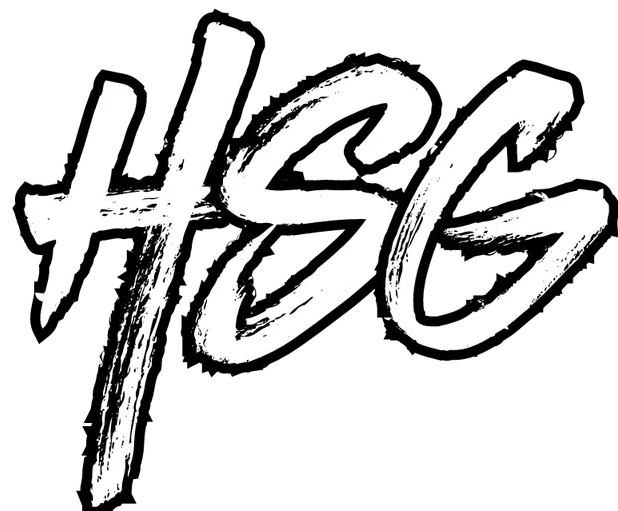

# HSG - Hamza Shahid's Portfolio



## Introduction

Welcome to my GitHub repository! This repository hosts the source code for my personal portfolio website. The portfolio showcases my skills, projects, and a brief summary of my life. Feel free to explore and learn more about me!

## Table of Contents

- [Introduction](#introduction)
- [Table of Contents](#table-of-contents)
- [Live Demo](#live-demo)
- [Technologies Used](#technologies-used)
- [Features](#features)
- [Installation](#installation)
- [Usage](#usage)
- [Contributing](#contributing)
- [License](#license)
- [Contact](#contact)

## Live Demo

Check out the live version of my portfolio: [[HSG Portfolio](https://hsghamza.github.io/Portfolio/)](#)

## Technologies Used

- HTML
- CSS
- JavaScript

## Features

1. **Responsive Design:** The portfolio is designed to be responsive, ensuring a seamless experience across different devices.

2. **Navigation:** The website includes a navigation bar with links to various sections, making it easy to navigate.

3. **Skills Section:** Highlighting my skills in different technologies, providing visitors with an overview of my expertise.

4. **Projects Section:** Showcasing some of the projects I've worked on, giving visitors a glimpse of my practical experience.

5. **About Me:** Providing a personal summary, giving insights into my academic and professional journey.

6. **Contact Button:** A call-to-action button that allows visitors to easily reach out to me.

7. **Footer with Social Links:** Including links to my social media profiles for networking.

## Installation

1. Clone the repository:

   ```bash
   git clone https://github.com/HSGHamza/your-repository.git

2. Open the index.html file in a web browser.
Usage
Feel free to use this portfolio template as a starting point for your own portfolio. Customize the content, add your projects, and make it unique to showcase your skills.

Contributing
If you have suggestions for improvements, feel free to open an issue or create a pull request. Contributions are welcome!

License
This project is licensed under the MIT License.

Contact:

LinkedIn: Hamza Shahid
Twitter: @hamzathehero72
Email: hamzathehero7@gmail.com
